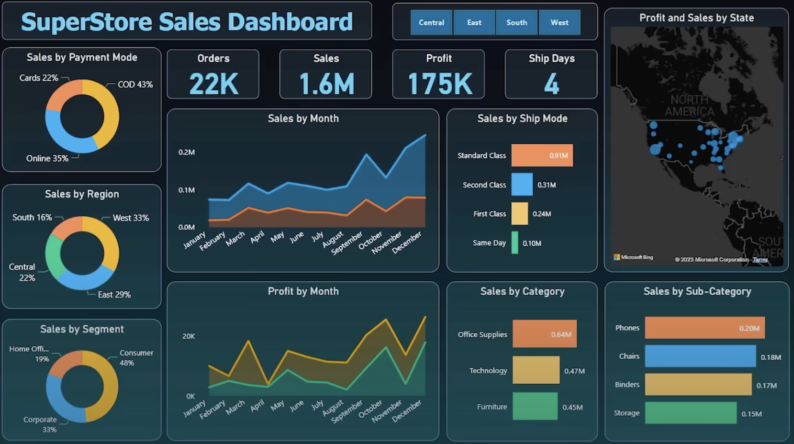

# 📊 SuperStore Sales Dashboard

This project is a **Power BI dashboard** built to analyze sales, profit, and order metrics for a SuperStore. The dashboard provides detailed insights across various dimensions such as region, ship mode, product categories, and payment modes.

## 🚀 Features

- **Interactive Data Visualization** using Power BI
- **KPIs Tracked**: Orders, Sales, Profit, and Ship Days
- **Sales Breakdown by**:
  - Payment Mode (COD, Cards, Online)
  - Region (Central, East, West, South)
  - Segment (Consumer, Corporate, Home Office)
  - Ship Mode (Standard, Second, First Class, Same Day)
  - Product Category and Sub-category
  - Time (Monthly Sales & Profit trends)
  - Geography (Profit & Sales by State using map visual)

## 📁 Project Files

- `SuperStore_Dashboard.png`: Snapshot of the Power BI dashboard
- `SuperStore_Sales_Dataset.csv`: Complete dataset used for analysis

## 🛠 Tools Used

- **Power BI Desktop**
- **Microsoft Bing Maps** (for geospatial visualization)

## 📌 Purpose

This dashboard is intended to demonstrate the capability of Power BI in performing multi-dimensional data analysis, making it suitable for business intelligence, reporting, and decision-making scenarios.

---

Feel free to clone this repository and explore the visualizations. Contributions are welcome!

